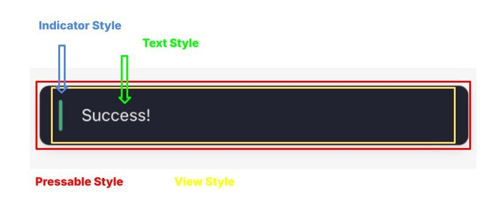

## Positioning

You can customize the position of the toast message by passing the `position` option to the `toast` function. Use the enum provided by React Native Toast.

### Position Types

```js
import {ToastPosition} from "@backpackapp-io/react-native-toast";

toast('Top Position', {
  position: ToastPosition.TOP,
});

toast('Bottom Position', {
  position: ToastPosition.BOTTOM,
});

toast('Bottom Right Position', {
  position: ToastPosition.BOTTOM_RIGHT,
});

```

### Extra Insets

You can also add extra insets to the toast message by passing the `extraInsets` option to the `toast` function.

```js
toast('Top Position with Extra Insets', {
  position: ToastPosition.TOP,
  extraInsets: {
    top: 20,
  },
});
```

## Styling Customization

You can customize the toast style by passing the `styles` option to the `toast` function or by supplying a defaultStyle to the `<Toasts />` component. The `text` style is not applied if you pass a custom message component to the `toast` function.
```
styles = {
  view?: ViewStyle;
  pressable?: ViewStyle;
  text?: TextStyle;
  indicator?: ViewStyle;
};
```




### Default Style

```js
<Toasts
  defaultStyle={{
    view: {
      backgroundColor: 'rgba(0, 0, 0, 0.8)',
      borderRadius: 8,
      padding: 16,
      margin: 16,
    },
    text: {
      color: 'white',
    },
    indicator: {
      marginRight: 16,
    },
  }}
/>
```

### Individual Toast Style

```js
toast('Custom Style', {
  styles: {
    view: {
      backgroundColor: 'rgba(0, 0, 0, 0.8)',
      borderRadius: 8,
      padding: 16,
      margin: 16,
    },
    text: {
      color: 'white',
    },
    indicator: {
      marginRight: 16,
    },
  },
});
```

## Icons

You can add icons to the toast message by passing the `icon` option to the `toast` function.

### Provided Icons
```js

import {Icon} from 'react-native-elements';

toast('Icon', {
  icon: <Icon name="check" />,
});

```

### Emoji Icons
```js
toast('Emoji Icon', {
  icon: '🚀',
});

```

### React Element Icons
```js
toast('React Element Icon', {
  icon: <CustomComponent />,
});

```

## Custom Toast Message

You can create a custom message component to display a custom message in the toast.

```js

const CustomMessage = (msg: string) => {
  return (
    <View style={{ flexDirection: 'row', alignItems: 'center' }}>
      <Icon name="check" />
      <Text>{msg}</Text>
    </View>
  )
}

toast(<CustomMessage msg="Custom Message" />);
```

## Custom Toast Component

You can override the entire `<Toast />` component by passing in a customToast prop to each toast function.

*Note: Since the toast message can be either a string or a React Element, you need to resolve the value of the message by using the `resolveValue` function.*

```js

import {Toast as ToastType, resolveValue} from "@backpackapp-io/react-native-toast";

const CustomToast = (toast: ToastType) => {
  return (
    <View style={{ flexDirection: 'row', alignItems: 'center' }}>
      <Text>{resolveValue(toast, toast.message)}</Text>
    </View>
  )
}

toast('Custom Toast Component', {
  customToast: CustomToast,
});
```
